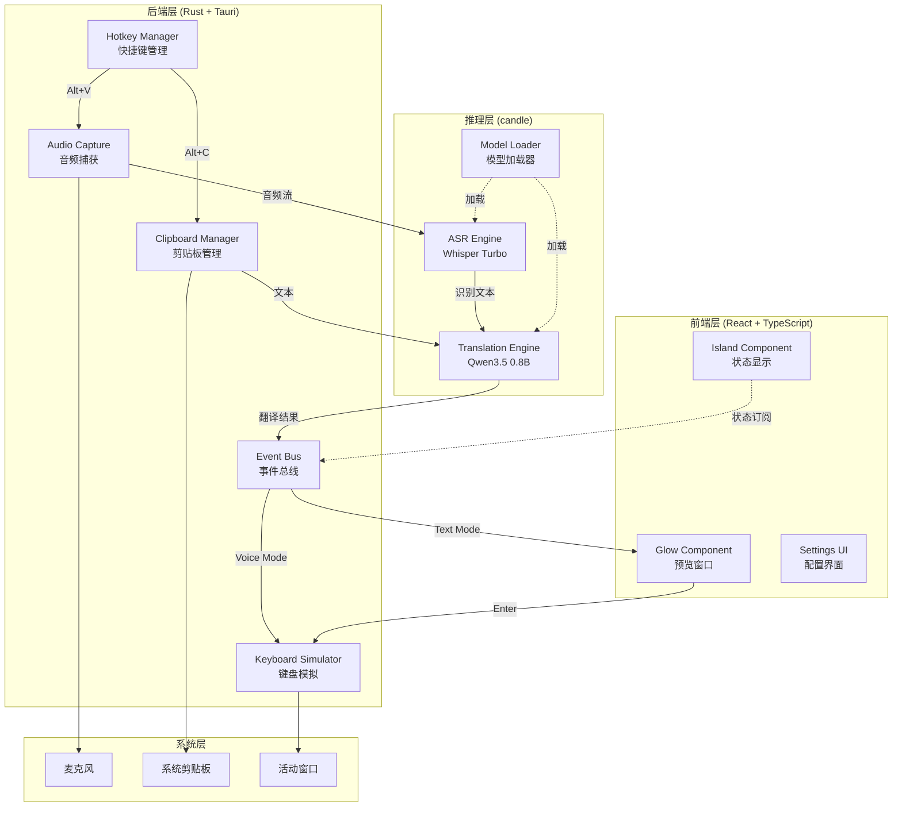

# Design Document: Visp AI 翻译助手

## Overview

Visp 是一款基于 Tauri 2.0 构建的跨平台离线 AI 翻译助手，集成 Whisper-large-v3-turbo 语音识别和 Qwen3.5-0.8B-Instruct 翻译引擎。应用采用 Rust 后端处理核心推理逻辑，Web 前端（React + TypeScript）实现动画丰富的用户界面。

### 核心设计目标

1. **完全离线运行**: 所有推理在本地完成，无需网络连接
2. **极致性能**: 空闲状态 CPU < 1%，内存 < 500MB，推理响应时间 < 5 秒
3. **无感交互**: 全局快捷键触发，自动输入/替换，无需切换窗口
4. **跨平台一致性**: Windows/macOS/Linux 统一体验

### 技术选型理由

- **Tauri 2.0**: 相比 Electron 更轻量（安装包 < 20MB），原生性能，内置全局快捷键和系统托盘支持
- **candle**: Meta 的 Rust ML 框架，支持 GGUF 模型加载，无需 Python 运行时
- **Enigo**: 跨平台键盘模拟库，支持 Unicode 输入
- **Framer Motion**: 声明式动画库，实现弹簧物理和流畅过渡

## Architecture

### 系统架构图



### 架构分层说明


1. **前端层**: 负责 UI 渲染和动画，通过 Tauri IPC 与后端通信
2. **后端层**: 处理系统集成（快捷键、剪贴板、键盘模拟）和业务逻辑编排
3. **推理层**: 封装 ML 模型推理，提供统一的异步接口
4. **系统层**: 操作系统原生 API

### 数据流

#### 语音模式流程
```
用户按下 Alt+V → 音频捕获 → Whisper 识别 → Qwen 翻译 → 键盘模拟输入
```

#### 文本模式流程
```
用户按下 Alt+C → 复制选中文本 → Qwen 翻译 → 预览窗口 → 用户确认 → 键盘模拟替换
```

## Components and Interfaces

### 1. Hotkey Manager (快捷键管理器)

**职责**: 注册和监听全局快捷键

**接口**:
```rust
pub struct HotkeyManager {
    registered_keys: HashMap<String, HotkeyId>,
    event_sender: mpsc::Sender<HotkeyEvent>,
}

impl HotkeyManager {
    /// 注册全局快捷键
    pub fn register(&mut self, key: &str, modifiers: Modifiers) -> Result<HotkeyId>;
    
    /// 注销快捷键
    pub fn unregister(&mut self, id: HotkeyId) -> Result<()>;
    
    /// 检查快捷键冲突
    pub fn check_conflict(&self, key: &str) -> bool;
    
    /// 启动监听循环
    pub async fn listen(&self) -> Result<()>;
}

pub enum HotkeyEvent {
    VoiceMode,
    TextMode,
}
```

**依赖**: `global-hotkey` crate (Tauri 内置)

### 2. Audio Capture (音频捕获)

**职责**: 捕获麦克风音频流并缓存

**接口**:
```rust
pub struct AudioCapture {
    device: cpal::Device,
    buffer: Arc<Mutex<Vec<f32>>>,
    is_recording: AtomicBool,
}

impl AudioCapture {
    /// 开始录音
    pub fn start_recording(&self) -> Result<()>;
    
    /// 停止录音并返回音频数据
    pub fn stop_recording(&self) -> Result<Vec<f32>>;
    
    /// 获取实时音频波形数据（用于可视化）
    pub fn get_waveform(&self) -> Vec<f32>;
    
    /// 检查麦克风权限
    pub fn check_permission() -> bool;
}
```

**依赖**: `cpal` crate (跨平台音频库)

**音频格式**: 16kHz, 单声道, f32 样本

### 3. ASR Engine (语音识别引擎)

**职责**: 使用 Whisper 模型将音频转换为文本

**接口**:
```rust
pub struct AsrEngine {
    model: WhisperModel,
    device: Device,
}

impl AsrEngine {
    /// 加载模型
    pub async fn load(model_path: &Path) -> Result<Self>;
    
    /// 识别音频
    pub async fn transcribe(&self, audio: &[f32]) -> Result<String>;
    
    /// 检测语言
    pub fn detect_language(&self, audio: &[f32]) -> Result<Language>;
}

pub struct WhisperModel {
    encoder: Tensor,
    decoder: Tensor,
    tokenizer: Tokenizer,
}
```

**模型规格**:
- 模型: whisper-large-v3-turbo
- 量化: Q4_0 (约 800MB)
- 推理时间: < 3 秒 (CPU)

**实现细节**:
- 使用 `candle-transformers` 加载 GGUF 格式模型
- 音频预处理: 重采样到 16kHz, 归一化到 [-1, 1]
- 支持语言: zh, en, auto-detect

### 4. Translation Engine (翻译引擎)

**职责**: 使用 Qwen3.5 模型进行中英互译

**接口**:
```rust
pub struct TranslationEngine {
    model: LlamaModel,
    device: Device,
}

impl TranslationEngine {
    /// 加载模型
    pub async fn load(model_path: &Path) -> Result<Self>;
    
    /// 翻译文本
    pub async fn translate(&self, text: &str) -> Result<String>;
    
    /// 检测源语言
    pub fn detect_language(&self, text: &str) -> Language;
}

pub enum Language {
    Chinese,
    English,
}
```

**模型规格**:
- 模型: Qwen3.5-0.8B-Instruct
- 量化: GGUF Q4_K_M (约 500MB)
- 推理时间: < 2 秒 (CPU)

**Prompt 模板**:
```
<|im_start|>system
You are a professional translator. Translate the following text from {source_lang} to {target_lang}. 
Preserve code snippets, technical terms, and formatting.<|im_end|>
<|im_start|>user
{input_text}<|im_end|>
<|im_start|>assistant
```

**语言检测逻辑**:
```rust
fn detect_language(text: &str) -> Language {
    let chinese_chars = text.chars().filter(|c| is_chinese(*c)).count();
    let total_chars = text.chars().count();
    
    if chinese_chars as f32 / total_chars as f32 > 0.3 {
        Language::Chinese
    } else {
        Language::English
    }
}
```

### 5. Clipboard Manager (剪贴板管理器)

**职责**: 读写系统剪贴板

**接口**:
```rust
pub struct ClipboardManager {
    clipboard: Clipboard,
    backup: Option<String>,
}

impl ClipboardManager {
    /// 读取剪贴板文本
    pub fn read_text(&self) -> Result<String>;
    
    /// 写入剪贴板文本
    pub fn write_text(&mut self, text: &str) -> Result<()>;
    
    /// 备份当前剪贴板内容
    pub fn backup(&mut self) -> Result<()>;
    
    /// 恢复备份的剪贴板内容
    pub fn restore(&mut self) -> Result<()>;
    
    /// 模拟 Ctrl+C 复制操作
    pub fn simulate_copy(&self) -> Result<()>;
}
```

**依赖**: `arboard` crate

**实现细节**:
- `simulate_copy`: 使用 Enigo 发送 Ctrl+C，等待 100ms 后读取剪贴板
- `restore`: 在文本替换完成后恢复原始剪贴板内容

### 6. Keyboard Simulator (键盘模拟器)

**职责**: 模拟键盘输入

**接口**:
```rust
pub struct KeyboardSimulator {
    enigo: Enigo,
}

impl KeyboardSimulator {
    /// 输入文本到活动窗口
    pub fn type_text(&mut self, text: &str) -> Result<()>;
    
    /// 模拟粘贴操作 (Ctrl+V)
    pub fn paste(&mut self) -> Result<()>;
    
    /// 模拟按键组合
    pub fn send_key(&mut self, key: Key, modifiers: &[Key]) -> Result<()>;
}
```

**依赖**: `enigo` crate

**实现细节**:
- `type_text`: 逐字符输入，支持 Unicode
- 输入速度: 延迟 10ms/字符，避免输入过快导致丢失
- 换行符处理: `\n` → Enter 键

### 7. Island Component (状态显示组件)

**职责**: 屏幕顶部显示录音和处理状态

**接口** (TypeScript):
```typescript
interface IslandProps {
  state: 'idle' | 'recording' | 'thinking' | 'error';
  waveform?: number[]; // 音频波形数据
  message?: string;
}

export const Island: React.FC<IslandProps> = ({ state, waveform, message }) => {
  // 实现
};
```

**样式规格**:
- 尺寸: 200px × 60px
- 位置: 屏幕顶部中央，距顶部 20px
- 背景: 毛玻璃效果 (backdrop-filter: blur(20px))
- 动画: Spring physics (stiffness: 300, damping: 20)

**状态显示**:
- `recording`: 显示实时波形动画
- `thinking`: 显示旋转加载动画
- `error`: 显示错误图标和消息

### 8. Glow Component (预览窗口)

**职责**: 显示翻译结果并等待用户确认

**接口** (TypeScript):
```typescript
interface GlowProps {
  translatedText: string;
  onConfirm: () => void;
  onCancel: () => void;
}

export const Glow: React.FC<GlowProps> = ({ translatedText, onConfirm, onCancel }) => {
  // 实现
};
```

**样式规格**:
- 最大尺寸: 600px × 400px
- 位置: 屏幕中央
- 背景: 毛玻璃效果 + 1px 渐变流光边框
- 动画: 淡入淡出 300ms

**边框动画实现**:
```css
@keyframes glow-rotate {
  0% { background-position: 0% 50%; }
  100% { background-position: 200% 50%; }
}

.glow-border {
  border: 1px solid transparent;
  background: linear-gradient(90deg, #a855f7, #ec4899, #a855f7) border-box;
  background-size: 200% 100%;
  animation: glow-rotate 3s linear infinite;
}
```

### 9. Model Loader (模型加载器)

**职责**: 管理模型文件的加载和验证

**接口**:
```rust
pub struct ModelLoader {
    models_dir: PathBuf,
}

impl ModelLoader {
    /// 检查模型文件是否存在
    pub fn check_models(&self) -> ModelStatus;
    
    /// 加载 ASR 模型
    pub async fn load_asr_model(&self) -> Result<AsrEngine>;
    
    /// 加载翻译模型
    pub async fn load_translation_model(&self) -> Result<TranslationEngine>;
    
    /// 验证模型文件完整性
    pub fn verify_model(&self, path: &Path) -> Result<()>;
}

pub struct ModelStatus {
    pub asr_available: bool,
    pub translation_available: bool,
    pub missing_files: Vec<String>,
}
```

**模型文件路径**:
- Windows: `%APPDATA%/visp/models/`
- macOS: `~/Library/Application Support/visp/models/`
- Linux: `~/.local/share/visp/models/`

**文件结构**:
```
models/
├── whisper-large-v3-turbo-q4_0.gguf
└── qwen3.5-0.8b-instruct-q4_k_m.gguf
```

### 10. Event Bus (事件总线)

**职责**: 协调前后端通信

**接口**:
```rust
#[derive(Serialize, Deserialize)]
pub enum AppEvent {
    // 状态更新
    StateChanged { state: AppState },
    
    // 音频事件
    RecordingStarted,
    RecordingStopped,
    WaveformUpdate { data: Vec<f32> },
    
    // 处理事件
    TranscriptionComplete { text: String },
    TranslationComplete { text: String, mode: Mode },
    
    // 错误事件
    Error { message: String },
}

pub enum AppState {
    Idle,
    Recording,
    Thinking,
}

pub enum Mode {
    Voice,
    Text,
}
```

**Tauri Command 示例**:
```rust
#[tauri::command]
async fn start_voice_mode(state: State<'_, AppState>) -> Result<()> {
    // 实现
}

#[tauri::command]
async fn confirm_translation(state: State<'_, AppState>) -> Result<()> {
    // 实现
}
```

## Data Models

### 配置数据模型

```rust
#[derive(Serialize, Deserialize, Clone)]
pub struct AppConfig {
    /// 快捷键配置
    pub hotkeys: HotkeyConfig,
    
    /// 翻译配置
    pub translation: TranslationConfig,
    
    /// UI 配置
    pub ui: UiConfig,
    
    /// 日志配置
    pub logging: LoggingConfig,
}

#[derive(Serialize, Deserialize, Clone)]
pub struct HotkeyConfig {
    pub voice_mode: String,  // 默认: "Alt+V"
    pub text_mode: String,   // 默认: "Alt+C"
}

#[derive(Serialize, Deserialize, Clone)]
pub struct TranslationConfig {
    pub direction: TranslationDirection,
    pub preserve_formatting: bool,  // 默认: true
}

#[derive(Serialize, Deserialize, Clone)]
pub enum TranslationDirection {
    Auto,
    ChineseToEnglish,
    EnglishToChinese,
}

#[derive(Serialize, Deserialize, Clone)]
pub struct UiConfig {
    pub opacity: f32,           // 0.0 - 1.0, 默认: 0.95
    pub animation_speed: f32,   // 0.5 - 2.0, 默认: 1.0
    pub auto_dismiss_timeout: u64,  // 秒, 默认: 10
}

#[derive(Serialize, Deserialize, Clone)]
pub struct LoggingConfig {
    pub level: LogLevel,
    pub max_file_size: u64,  // MB, 默认: 50
}

#[derive(Serialize, Deserialize, Clone)]
pub enum LogLevel {
    Error,
    Warn,
    Info,
    Debug,
}
```

**配置文件路径**:
- Windows: `%APPDATA%/visp/config.json`
- macOS: `~/Library/Application Support/visp/config.json`
- Linux: `~/.config/visp/config.json`

### 运行时状态模型

```rust
pub struct AppState {
    /// 当前工作模式
    pub mode: Option<Mode>,
    
    /// 音频捕获器
    pub audio_capture: Arc<Mutex<AudioCapture>>,
    
    /// ASR 引擎
    pub asr_engine: Arc<AsrEngine>,
    
    /// 翻译引擎
    pub translation_engine: Arc<TranslationEngine>,
    
    /// 剪贴板管理器
    pub clipboard_manager: Arc<Mutex<ClipboardManager>>,
    
    /// 键盘模拟器
    pub keyboard_simulator: Arc<Mutex<KeyboardSimulator>>,
    
    /// 配置
    pub config: Arc<RwLock<AppConfig>>,
    
    /// 事件发送器
    pub event_sender: mpsc::Sender<AppEvent>,
}
```

### 日志数据模型

```rust
#[derive(Serialize, Deserialize)]
pub struct LogEntry {
    pub timestamp: DateTime<Utc>,
    pub level: LogLevel,
    pub module: String,
    pub message: String,
    pub context: Option<serde_json::Value>,
}
```

**日志文件路径**:
- Windows: `%APPDATA%/visp/logs/visp.log`
- macOS: `~/Library/Logs/visp/visp.log`
- Linux: `~/.local/share/visp/logs/visp.log`

